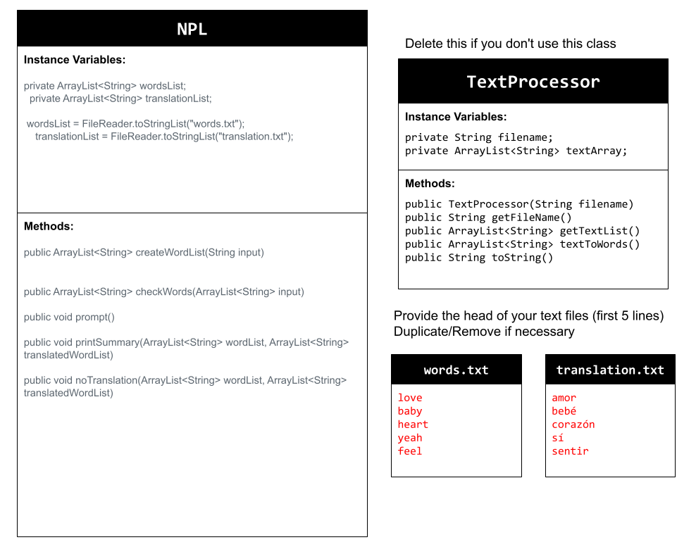

# Unit 6 - Natural Language Processing Project

## Introduction

Natural language processing (NLP) is used in many apps and devices to interact with users and make meaning of text to determine how to respond, find information, or to create new text. Your goal is to use natural language processing techniques to identify structure, patterns, and meaning in a text to have conversations with a user, execute commands, perform manipulations on the text, or generate new text.

## Requirements

Use your knowledge of object-oriented programming, ArrayLists, the String class, and algorithms to create a program that uses natural language processing techniques:

- **Create at least two ArrayLists** – Create at least two ArrayLists to store the data used in your program, such as data from text files or entered by the user.
- **Implement one or more algorithms** – Implement one or more algorithms that use loops and conditionals to find or manipulate elements in an ArrayList or String object.
- **Use methods in the String classs** - Use one or more methods in the String class in your program, such as to divide text into sentences or phrases.
- **Use at least one natural language processing technique** – Use a natural language processing technique to process, analyze, and/or generate text.
- **Document your code** – Use comments to explain the purpose of the methods and code segments and note any preconditions and postconditions.

## UML Diagram

Put and image of your UML Diagram here. Upload the image of your UML Diagram to your repository, then use the Markdown syntax to insert your image here. Make sure your image file name is one word, otherwise it might not properly get display on this README.

## Video

Record a short video of your project to display here on your README. You can do this by:

- Screen record your project running on Code.org.
- Upload that recording to YouTube.
- Take a thumbnail for your image.
- Upload the thumbnail image to your repo.
- Use the following markdown code:

## Project Description

The goal that this program works on solving is the translation of song titles. Overall, the program takes user input, which is intented to be song titles, and translates the text into Spanish. The text is interpreted through text files such as the words.txt that we have. The code works to find the index of one word in the word.txt and looks for it in the translation.txt for the translated word. This is done when the user input is received. Afterwards, the original song title and translated song title is returned. 

## NLP Techniques

The natural language techniques that were implemented into our project were machine translations, user input, and text processing. These all work together in the methods such as prompt(); promptSummary(); createWordList(); and checkWords();. These methods are necessary for the NLP techniques because they accept user input, and processes the text inputed in order to use machine translations and return a translation in Spanish.
